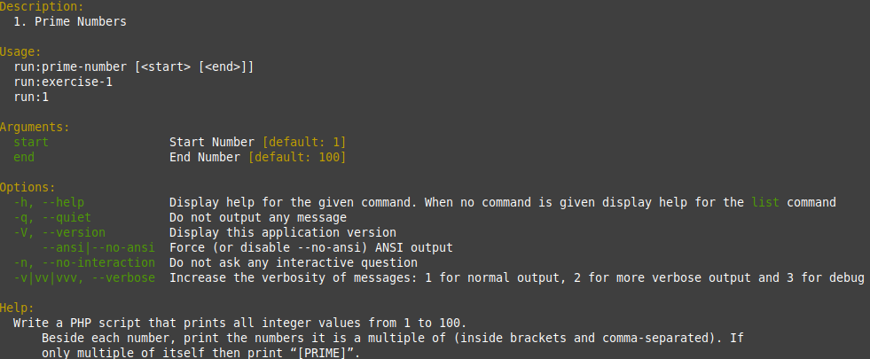
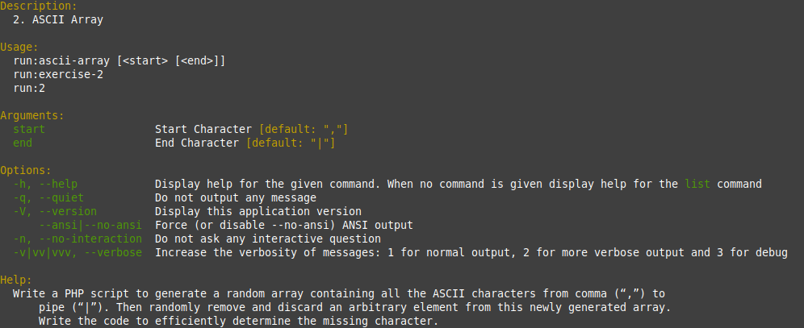
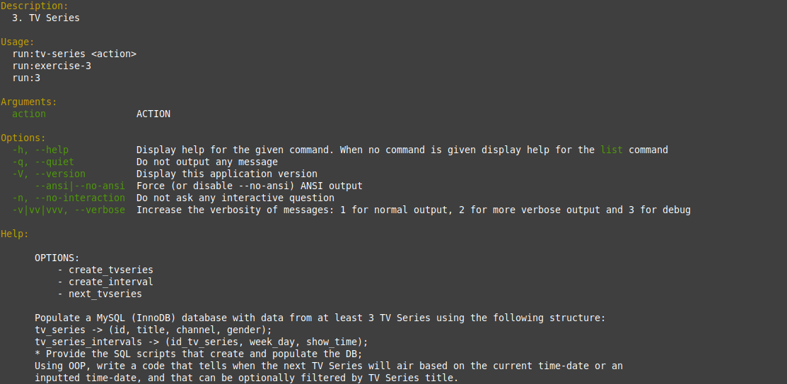
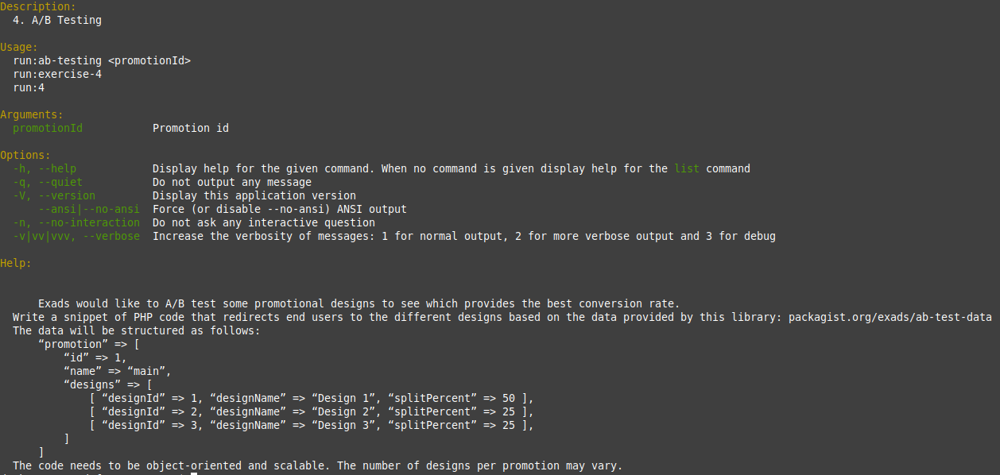

# Installation

This Project uses docker system to run, but you can also run without docker just skip the steps of docker commands.

## Setp 1: Configure .env file

Copy the .env.example to .env and change to your configs

## Step 2: Build and run the containers

Build the containers

```
docker-compose build
```
It should install the dependencies automatically.

Up the containers
```
docker-compose up -d
```
## Step 3: Create database (no container version)
***If you are running in docker container skip this step***

Inside [./schema/schema.sql](./schema/schema.sql) is the script to create the database and populate them. 

# Run the commands

Available commands
- php app run:prime-number
- php app run:ascii-array
- php app run:tv-series
- php app run:ab-testing

Corresponding aliases 
- php app run:1
- php app run:2
- php app run:3
- php app run:4

## On Docker
To run the commands you replace <command> with command that you want to run and arguments if necessary.
```
docker-compose exec  php-exads php app run:<command> <args1> <args2> ...
```
You can also see more information about command unsing --help option
```
docker-compose exec  php-exads php app run:<command> --help
```
## On local enviroment
```
php app run:<command> <args1> <args2> ...
```
You can also see more information about command unsing --help option
```
php app run:<command> --help
```
### Assets





### Domain Driven Design

- Application: Holds the application-specific logic, including command and handler pairs for each use case.
- Domain: Contains the core business logic, entities, repositories, and services. Contains common object.
- Infrastructure: Implementations of repositories that interact with databases or external services. Communication with what is outside your application, like the database
- Presentation: Manages the user interface and interactions with external systems. Views or text resources.

